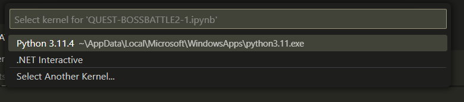
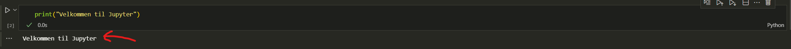

# Velkommen til GitHub og første introduksjon til Python

#### Python er for mange det første steget inn i programmering, og er et greit og oversiktig kodespråk å starte med.

#### Denne introduksjonen og øvingsoppgavene går gjennom de fleste viktige konsepter som en utvikler må forstå, med andre ord; skal du satse på utvikling bør du forstå alle konseptene som blir gjennomgått her!

#### Lykke til!

# Du skal laste ned (klone repoet) ved hjelp av git

### Under finner du guide på hvordan du laster ned oppgavene

---

# 1. Installere Visual Studio Code og utvidelser

Første steg er å installere VS Code. Dette er som å installere de fleste andre programmer:

1. Last ned installasjonsprogrammet for VS Code fra https://code.visualstudio.com.
2. Kjør installasjonsprogrammet. Standard-valg i installasjonsprosessen bør fungere fint, så
   bare kjør gjennom.
3. Når installasjonsprogrammet er ferdig åpner du VS Code.
   Med VS Code installert er det på tide å installere to utvidelser: Python og Markdown All in
   One:
4. Åpne utvidelsesvinduet i VS Code. Dette er de fire firkantene i menyen på venstre side (se
   Figur 1).
5. I søkefeltet som dukker opp skriver du Python. I lista over utvidelser skal du da se en som
   bare heter Python.
6. Trykk Install-knappen på Python-utvidelsen.
7. Gjør det samme for Markdown All in One, altså søk på den og trykk Install.
8. Når Python-utvidelsen er ferdig vil det dukke opp et vindu der du har noen valg. Først
   er det en knapp for å installere Python. Om du ikke har gjort det allerede, kan du trykke
   på den og installere Python. For Windows åpner dette Microsoft Store, som enkelt lar deg
   installere en moderne versjon av Python.
9. Neste steg er Select Python Interpreter. Om du nettopp installerte Python må du lukke og
   gjenåpne VS Code før du gjør dette. Deretter trykker du på knappen, og velger Pythoninstallasjonen
   din fra lista som dukker opp. Nå er du klar til å skrive og kjøre Python i VS
   Code.

# 2. Installere Git

Git er et system som blant annet kan brukes for deling av kode. Dere trenger ikke å kunne
bruke Git selv akkurat nå, men for å laste ned oppgavene lokalt på datamaskinen deres, må det installeres:

1. Gå til http://git-scm.com og last ned installasjonsprogrammet for Git.
2. Kjør installasjonsprogrammet. Så å si alle valg kan du bruke standarden. Eneste jeg anbefaler
   å endre er da du kan velge en tekst editor å bruke for git. Standarden her er vim, som
   ikke er det mest brukervenlige, så om du ikke har brukt det før anbefaler jeg å endre til
   noe annet, f.eks. VS Code eller git Bash. Det grafiske brukergrensesnittet i VS Code er ganske godt, og det finner du ved knappen "Source control"
3. Ellers er det bare å kjøre gjennom installasjonen uten å endre noe.

# 3. Sette opp oppgavesystemet

Neste er å hente ned oppgavene:

1. Gå til https://github.com/jonp-h/KPR-intro-til-python
2. På nettsiden du kommer inn på er det en grønn knapp der det står Clone. Trykk
   på den og kopier lenken under Clone with HTTPS.
3. Åpne VS Code og pass på at ingen mapper er åpne (Trykk på File og Close Folder hvis
   den er tilgjengelig).
4. Gå til Source Control-vinduet i VS Code. Dette er knappen på venstre side med tre sirkler
   og streker i mellom.
5. I menyen som åpnes trykker du på Clone Repository.
6. I tekstfeltet som popper opp limer du inn lenka du kopierte i sted og trykker enter.
7. En filbehandler åpnes opp. Her velger du hvor du vil lagre oppgavene i faget. Plasseringen
   har ingen betydning, men det er lurt å velge et sted du husker selv. Her vil jeg anbefale å opprette en KPR mappe om du ikke allerede har det i Tiller vgs mappen din.
8. Nå lastes øvingene ned. Når det er ferdig får du opp en popup. Trykk på
   Open.
9. Du skal nå komme inn i et VS Code-vindu som inneholder filene til øvingsopplegget.
10. Videre kan det hende at du må installere flere jupyter-utvidelser (extensions), en .NET SDK samt, en python kernel, samt selve python språket fra Microsoft Store. (En god regel her er å bare trykke ok og videre helt til alt fungerer)
11. Når du klarer å trykke på play-knappen ved en kodeboks eller ctrl+enter mens du har markert en kodeboks og **får output under boksen** (Se bilde under) har du gjort alt riktig! Merk at det kommer opp en boks på toppen av skjermen din som sier at du må velge en "kernel". Her skal du velge "Python Environments" og den nyeste versjonen av Python du har installert. (Har du ikke Python som et valgalternativ må du passe på at du har [installert Python](https://www.python.org/))
12. Får du output fra kodeblokkene er alt satt opp riktig, og det er bare å sette i gang! :)

Denne boksen kommer opp på toppen av skjermen din når du skal velge kernel:

Slik skal output fra kodeboksene se ut når du har installert alt riktig:

# 5. NB! For å laste ned nye oppgaver kan du hente oppdateringer

Underveis i faget kan det hende at flere oppgaver legges ut. For å hente ned de nye skal du IKKE følge samme
prosedyre som over igjen, men i stedet gjøre følgende:

1. Pass på at VS Code er åpnet i øvingsmappa.
2. Gå inn i Version Control-vinduet i VS Code.
3. Trykk på de tre prikkene øverst i høyre hjørne i sidebaren som dukker opp, og Pull i den
   menyen.
4. Nå henter VS Code ned alle nye filer som har blitt publisert på serveren. De vil dukke opp
   i filvinduet når denne prosessen er ferdig.
